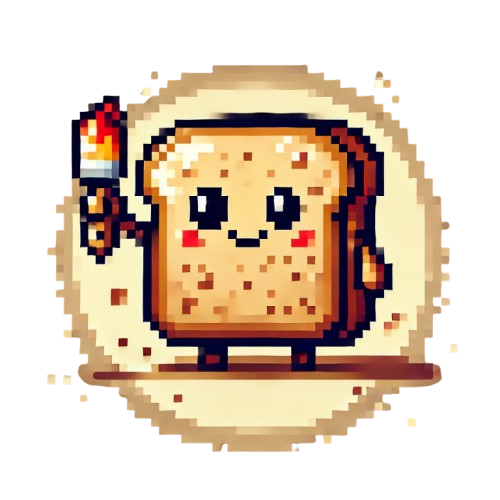

# Toasty: A 2D WebGPU Game Engine

  

Toasty is a game engine built with WebGPU, specifically designed for creating 2D (and 2.5D) games that can run in any browser. Toasty is licensed under the [MIT License](./LICENSE).

## Work in Progress

This project is under active development. Expect that APIs may be missing, incomplete, or subject to change. If you're feeling adventurous and want to try it out, please check the [documentation](https://story75.github.io/toasty-engine/) and report any issues you encounter.

## Core Design Principles

Toasty is guided by these design goals:

*   **Lightweight Core:** The engine's core will be kept small and easy to understand. Complex features will be developed as separate, modular packages.
*   **2D Focused:** Primarily targets 2D pixel art games, with the possibility of creating 2.5D games as well.
*   **Common Functionality:** Provide common game development essentials such as input handling, rendering, and physics.
*   **Built-in Editors:** Includes editors for creating game levels, animations, and managing game data (items, characters, etc.).
*   **Modular Architecture:** Designed to be highly modular, allowing users to easily add, remove, or replace features.
*   **Reasonable Defaults:** Provides good default settings to enable users to start quickly.
*   **Simplicity:** Focuses on simplicity for 2D game development, avoiding the need for complex 3D features.
*   **Comprehensive Documentation:** Provides clear and complete documentation for easy learning and usage.

## Out of Scope

These areas are intentionally *not* in the scope of Toasty:

*   **3D Graphics:** No support is planned for sophisticated 3D games or high-end 3D graphics.
*   **High Performance Focus:** Prioritizes simplicity, ease of use, and rapid iteration over raw performance where appropriate.
*   **Universal Cross-Platform Support:** Focuses on desktop platforms primarily, with mobile support as a secondary goal.
*   **Competition with Existing Engines:** Does not aim to be a direct competitor to engines like Unity, Godot, or Unreal.

## 2.5D Definition

In the context of Toasty, "2.5D" refers to games that utilize simple 3D environments with a fixed-perspective camera. Sprites in these environments are rendered as 2D billboards that always face the camera.

## Platform Support

Toasty aims to support any platform that can run [NW.js](https://nwjs.io/). This primarily includes:

*   Windows
*   macOS
*   Linux

## Getting Started

To begin using Toasty, please refer to the "[Getting Started](https://story75.github.io/toasty-engine/users/getting-started)" section of the user documentation.

## Motivation Behind Toasty

The core vision for Toasty is to create an engine that offers the user-friendly experience of RPG Maker, but with greater flexibility and control. While RPG Maker is excellent for learning the basics of game development, its restrictiveness and easily identifiable style make games made with it readily apparent.

Toasty is designed to offer a more open approach. The goal is to have a simple and easy-to-use engine that allows for rapid prototyping and development of pixel art games. At the same time, Toasty should provide sufficient flexibility to allow users to customize almost every aspect of their game.

Unlike other engines (e.g., LÖVE), Toasty aims to include more "batteries included," meaning it will incorporate editors for creating and editing levels, items, and other game assets directly within the engine, minimizing the need for separate tools (unless the user prefers them).

## Contributing

If you are interested in contributing to Toasty, please refer to the "[Getting Started](https://story75.github.io/toasty-engine/contributors/getting-started)" section of the contributor documentation.
