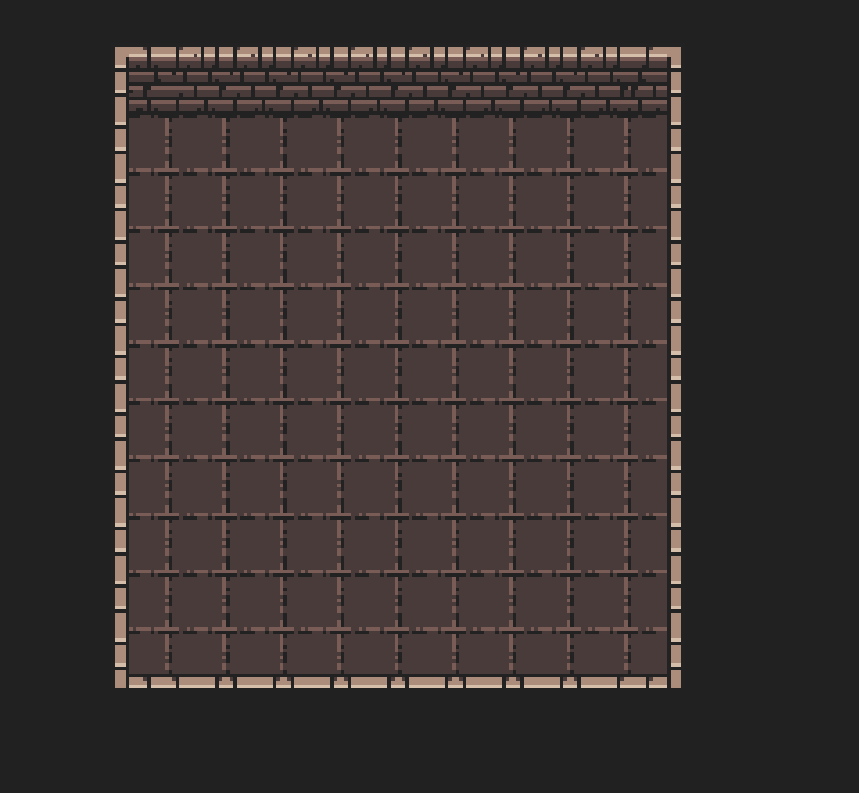

# Toasty Tilemap Prototype

A prototype tilemap renderer for the Toasty Engine.

This example tries to find the requiered building blocks to create a tilemap renderer in Toasty.

## How does it work?

This example is based on the webgpu-sprite example. This prototype will refine the example and be used as a playground for new features.
The goal is to create a tilemap renderer that can be used in a game with minimal effort.

Maps should be defined as json so other tools can be used to create them, possibly even with Tiled and LDTK support or compatibility.
Tilemaps should in the best case just reuse the normal sprite renderer and just add some additional logic to handle the tilemap data.

In the most basic form, the tilemap renderer should be able to receive a map.json file and render it to the screen.

The current prototype is able to render a simple tilemap with a single tileset.
The result looks like this:

  

## License

This package is part of the Toasty Engine project and is licensed under the MIT License.

## Acknowledgements

This example uses the 16x16 DungeonTileset II by 0x72 at [public/0x72_DungeonTilesetII_v1.7.png](public/0x72_DungeonTilesetII_v1.7.png).
The tileset can be found [here](https://0x72.itch.io/dungeontileset-ii).
It is licensed under the [CC-0](https://creativecommons.org/publicdomain/zero/1.0/) license.

It also uses [public/buch-outdoor.png](public/buch-outdoor.png) by [Michele "Buch" Bucelli](https://opengameart.org/users/buch).
The tileset can be found [here](https://opengameart.org/content/outdoor-tiles-again).
It is licensed under the [CC-BY 3.0](https://creativecommons.org/licenses/by/3.0/) license.